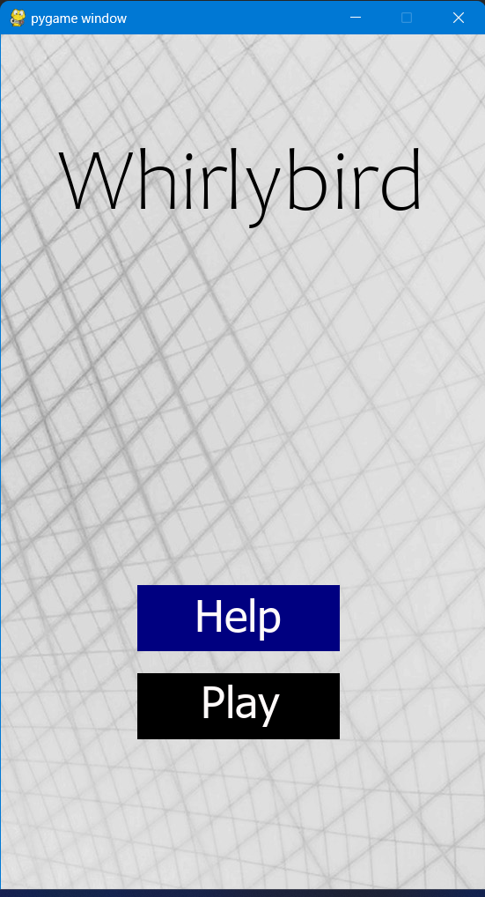
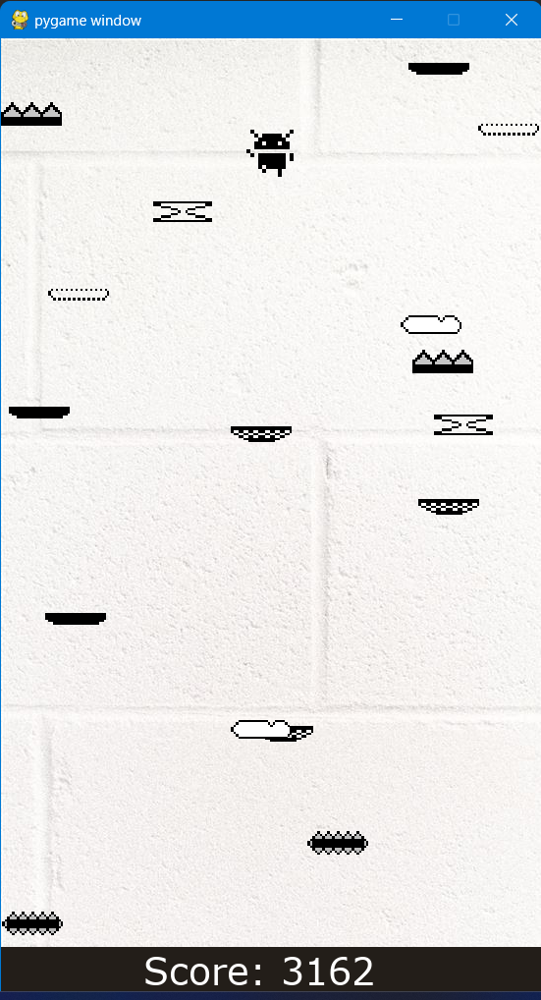
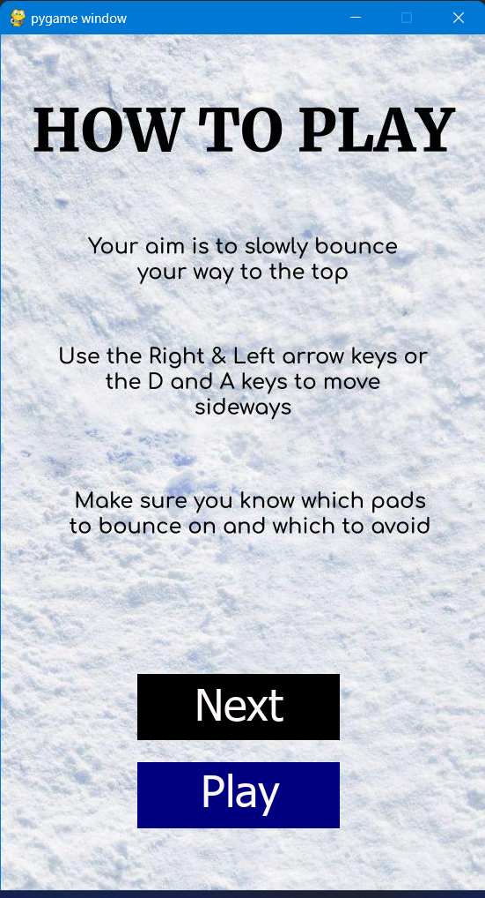
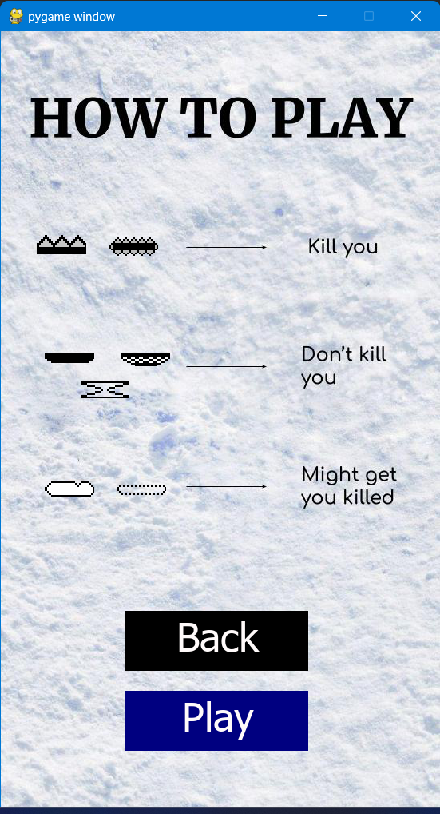
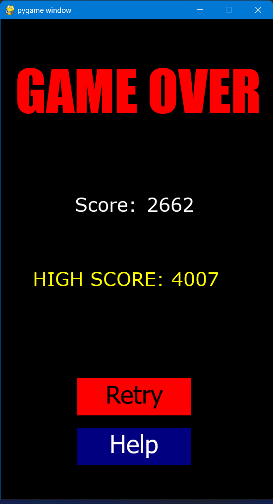

# Whirlybird

## A Recreation of the Famous Google Game

The game has a black Android sprite that tries to jump as *high* as possible. In the process, it lands on *different platforms with different effects* (like breaking upon landing, killing the sprite, acting like a trampoline, etc.). The player needs to evade dangerous platforms and land on the favourable ones so that the sprite can continue to jump higher and score more.

## Start Screen

    

 

The Start screen contains a simple wallpaper with the game's name and a couple of buttons.

- **Help** - Takes the player to the help screen which contains instructions and tips
- **Play** - Takes the player to the game

## Game Screen

    

 

The game starts with the Android sprite bouncing on various platforms that are all moving sideways. To choose which platform to land on, the user must use the **left/right arrow keys** or the **A/D keys**.

The **score**, which is based on the amount of time the sprite is alive, is displayed at the bottom of the screen.

## Help Screens

<table style="margin-left: auto; margin-right: auto;">
  <tr><th>Help Screen #1</th>           <th>Help Screen #2</th>
  <tr><td></td>   <td></td>
</table>

The Help screens contain a brief description of the game's objective along with its controls and what each kind of platform does to the Android sprite.

## End Screen

    

 

The end screen appears when the Android sprite falls on one of the spiked platforms. It displays the current score and the high score. Along with that, it has a couple of buttons.

- **Retry** - Takes the player back to the game
- **Help** - Takes the player to the first help screen